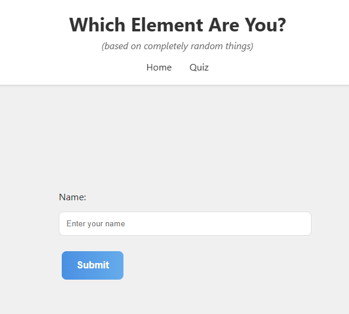
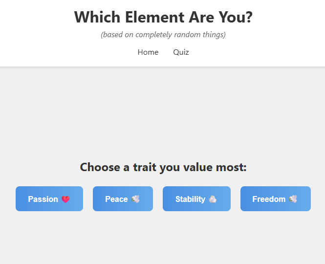
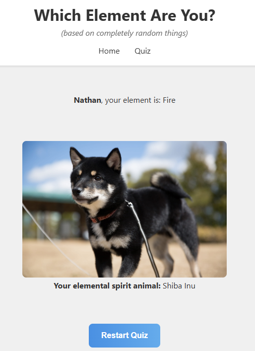

# Elemental Personality Quiz

Welcome to the **Elemental Personality Quiz**, a polished and interactive web application designed to reveal your inner element—Fire, Water, Earth, or Air. This project showcases a complete full-stack development cycle, featuring a dynamic React frontend that communicates with a custom Node.js backend proxy.

The user experience is paramount, with a layout engineered for stability (zero layout shift), smooth CSS animations, and a responsive design that feels great on any device. What started as a simple quiz evolved into a demonstration of solving real-world development challenges like Cross-Origin Resource Sharing (CORS) and creating a seamless, professional user interface.

## ✨ Live Demo & Preview

A picture is worth a thousand words, but a GIF is worth a million.

*(Suggestion: Record a short GIF of your app in action using a tool like Giphy Capture or ScreenToGif and replace the placeholder below!)*

``

| Home Page | Quiz Question | Results Page |
|-----------|---------------|--------------|
|  |  |  |

## 🌟 Key Features

- **Interactive Quiz Flow**: A multi-step quiz that guides the user from entering their name to discovering their elemental result.
- **Stable UI with Zero Layout Shift**: The header is fixed and content areas have a reserved minimum height, preventing the jarring "jump" of elements as content loads, ensuring a smooth user experience.
- **Dynamic CSS Transitions & Animations**: Buttons are interactive with gradient hover effects, and new components gracefully fade in, creating a polished and modern feel.
- **Backend Proxy Server (Node.js & Express)**: A custom backend server that acts as a proxy to communicate with the Dog API, completely solving potential CORS issues.
- **Keyless API Integration**: Utilizes the free and open [dog.ceo API](https://dog.ceo/dog-api/) to fetch images, demonstrating the ability to work with external services without exposing credentials.
- **Centralized & Customizable Styling**: A single `App.css` file uses CSS Variables (`:root`) for easy theming, allowing the entire app's color scheme (including gradients) to be changed in one place.
- **Protected Routing**: The quiz page is protected, ensuring a user must provide a name before proceeding.

## 🛠️ Tech Stack

- **Frontend**: React, React Router, Custom CSS3 (with Flexbox and Animations)
- **Backend**: Node.js, Express.js, Axios
- **API**: The Dog API (`dog.ceo`)
- **Development Environment**: Create React App, Node.js

## 🚀 Getting Started

Follow these instructions to get a copy of the project up and running on your local machine for development and testing purposes.

### Prerequisites
- Node.js (v16 or higher is recommended)
- npm (comes bundled with Node.js)

### Installation

**Important:** This project contains two parts: a frontend client and a backend server. You will need to run them in two separate terminal windows.

1.  **Clone the Repository**:
    ```bash
    git clone https://github.com/<your-username>/elemental-quiz.git
    cd elemental-quiz
    ```

2.  **Install Frontend Dependencies**:
    In the root directory (`/elemental-quiz`), run:
    ```bash
    npm install
    ```

3.  **Install Backend Dependencies**:
    Navigate into the server directory and install its dependencies.
    ```bash
    cd server
    npm install
    ```

4.  **No Environment Variables Needed!**
    This project uses a keyless API, so no `.env` files or API keys are required.

### Running the Application

1.  **Start the Backend Server**:
    In the `/server` directory, run:
    ```bash
    node index.js
    ```
    You should see the confirmation message: `✅ Server is running on port: 3001`

2.  **Start the Frontend Application**:
    Open a **new terminal window**. Navigate back to the root directory (`/elemental-quiz`) and run:
    ```bash
    npm start
    ```
    This will open the application in your browser at `http://localhost:3000`. The frontend will automatically proxy its API requests to the backend server running on port 3001.

## 🧠 Architectural Highlights

- **Client-Server Architecture**: The application is cleanly separated into a React client that manages the user interface and state, and a Node.js server whose sole responsibility is to handle external API requests.
- **Solving CORS with a Proxy**: The browser's same-origin policy prevents a frontend on `localhost:3000` from directly calling an external API. The Node.js server acts as a trusted proxy. The frontend makes a safe request to its own backend (`/api/artwork`), which then securely calls the external Dog API on the server-side, bypassing all browser CORS restrictions.
- **Preventing Cumulative Layout Shift (CLS)**: The `header` is styled with `position: fixed` to remove it from the document flow, ensuring it never moves. The main content area has a `min-height`, creating a stable "stage" so that content loading (like questions or results) doesn't push the layout around.

## 📈 Future Improvements

- Add more questions for deeper personality insights.
- Allow users to select from different image APIs (e.g., Unsplash for landscapes, Cat API).
- Implement user profiles to save quiz history and results.
- Enhance animations with a dedicated library like Framer Motion for more complex page transitions.

## 🙌 Acknowledgments

- **Codédex**: For providing the excellent Framework Valley: React course that inspired this project.
- **The Dog API**: For their fun, free, and easy-to-use image API.

## 📬 Contact

Your Name – [LinkedIn](https://www.linkedin.com/in/nathan-yap-jia-de-8b1836368) 

Project Link: [https://github.com/nathanyap17/elemental-quiz](https://github.com/nathanyap17/elemental-quiz)

---

*Built with passion, a dash of ⚛️, and a lot of 🐶 for the Codédex Framework Valley course.*